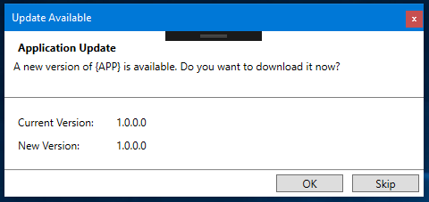

# SquirellWindowsExtra
Provides a ClickOnce style update dialog(WPF) to make it easy to check for updates an provide a UI for appling those updates.

## Details

`UpdateableApplication` provides and `Application` implementation that checks for updates on the launch of the WPF application.

It will check to see if the is a Squirrel.Windows update available and then present a dialog allowing the user to install or skip the update.

## Howto

Coming soon...for now look at the sample

